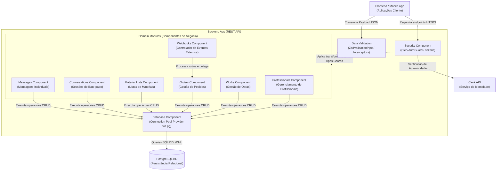

# Diagrama de Componentes (Nível 3) - Backend REST API

Este diagrama apresenta a arquitetura a nível de Componentes (Nível 3 do modelo C4) focada no "Backend App". Ele destrincha a API em suas diferentes lógicas modulares de domínio e serviços fundamentais adaptadores.

## Detalhamento dos Componentes

- **WebApp / Clientes Externos:** Consumem as APIs REST documentadas no sistema, enviando solicitações protegidas e com esquema de dados esperado.
- **Security Component:** Centraliza a camada de Guards (`ClerkAuthGuard`). Ele é a guarita do sistema, assegurando que as solicitações anônimas não prossigam para os componentes de domínio e que os perfis tenham os papéis adequados. Faz contato com o provedor `Clerk`.
- **Validation Component:** Atua na camada lógica de _Pipes_ para validar objetos em transferência (DTOs) contra as assinaturas contidas no escopo global `@obrafacil/shared`.
- **Domain Modules:** Coleção dos contêineres lógicos (Módulos do NestJS) que retêm toda a regra de negócio da aplicação. As separações garantem o baixo acoplamento.
  - Obras, Pedidos, Listas de Materiais e Profissionais operam de forma isolada servindo suas rotas.
  - Comunicações cruzadas geralmente se dão apenas entre serviços (ex: Um Webhook atualiza o status de um pedido).
- **Database Component / Adapter:** Abstrai a dependência do gerenciador de banco de dados (`pg pool`), garantindo gerência de conexões de vida curta/longa e centralizando interações transacionais com o Node.js em prol da entrega de resultados via formato relacional direto (SQL puro/migrações configuradas).
