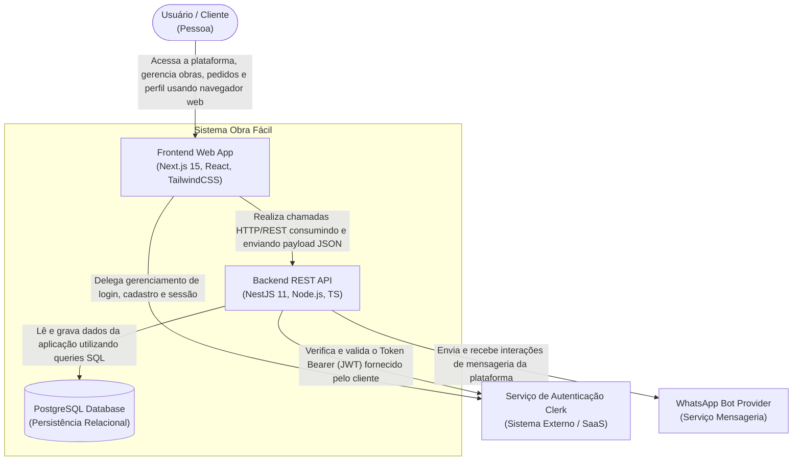

# Diagrama de Contêineres (Nível 2) - Obra Fácil

Este diagrama apresenta a arquitetura a nível de Contêineres (Nível 2 do modelo C4). Aqui a visão do sistema é aprofundada demonstrando os aplicativos hospedáveis, as estruturas de banco de dados e as dependências e sistemas externos mapeando o fluxo de macro comunicação.

## Detalhamento dos Contêineres

- **Usuário / Cliente:** O ator primário que utiliza o sistema (construtores, clientes, corretores, etc.) acessando via navegador web ou de um dispostivo móvel.
- **Frontend Web App (Next.js):** Contêiner que fornece todo o SPA/SSR (Single Page Application / Server-Side Rendering) que roda no browser. Ele é inteiramente responsável por prover a experiência UI/UX, formulários, renderização visual e interface de roteamento ao usuário final.
- **Backend REST API (NestJS):** Contêiner lógico responsável pelas regras de escopo de negócio do sistema. Protegendo a integridade, validando dados (Zod, Pipes), interligando módulos (Obras, Pedidos, Profissionais, Webhooks) e conversando de modo transacional com o recurso principal de banco de dados e APIs terceiras.
- **PostgreSQL Database:** Contêiner de armazenagem de dados persistente. Entidade isolada responsável por fornecer confiabilidade, relacionamentos complexos, e velocidade de busca aos dados cadastrais e transacionais do domínio do projeto. 
- **Serviço de Autenticação (Clerk):** Um sistema externo robusto consumido pelos contêineres principais de modo que alivia ao máximo carga sensível do projeto em si. O front-end delega a ele o Input das credenciais do usuário. O back-end delega a ele a checagem se o token da requisição é autêntico de fato.
- **WhatsApp Bot / Mensageria:** Ator de sistema externo onde o Backend também se conecta para o disparo proativo de status/updates e interações automáticas visando enriquecer a conexão com clientes.
