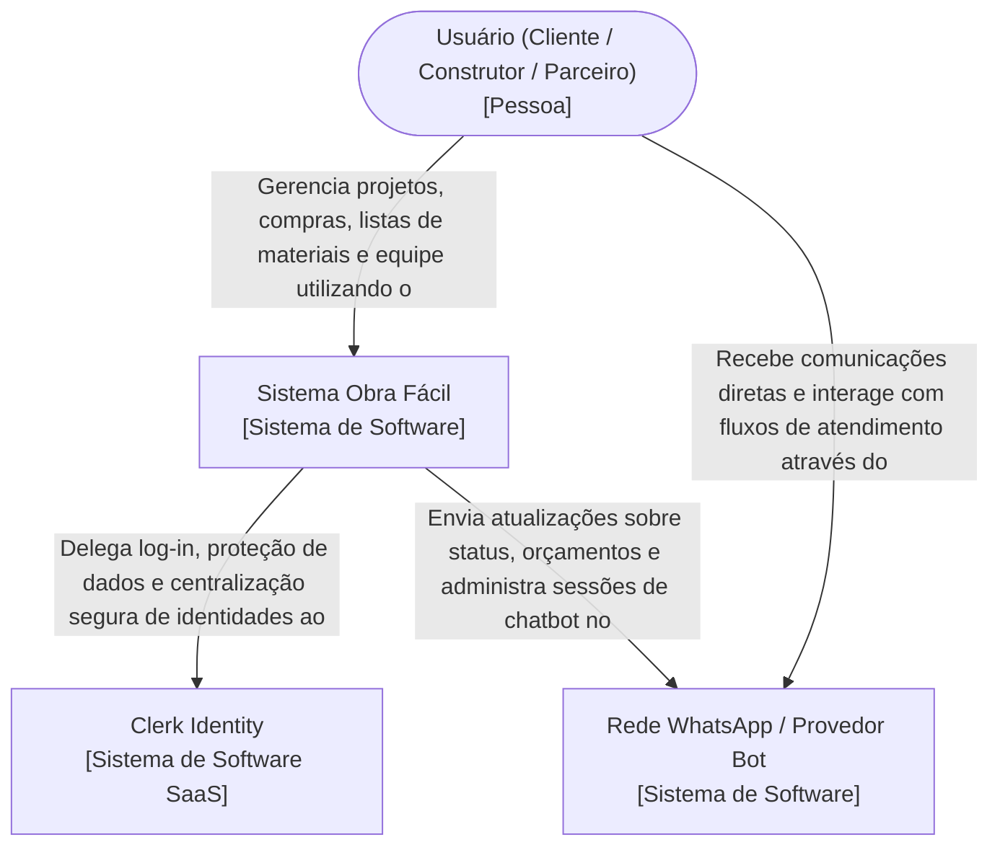

# Diagrama de Contexto (Nível 1) - Obra Fácil

Este diagrama apresenta a arquitetura a nível de Contexto do Sistema (Nível 1 do modelo C4). Trata-se de uma visão panorâmica voltada ao comportamento da empresa ou negócio, focando nas grandes interações do usuário principal com a nossa solução vista como um único bloco lógico ("A Grande Caixa Preta"), e das interações do nosso sistema com outros elementos SaaS externos para cumprir o seu propósito.

## Detalhamento do Contexto

Neste nível abstraímos linguagens de programação, bancos de dados em nuvem e servidores de interface isolados, focando fundamentalmente no **valor entregue ao negócio**, em quem se beneficia dele, e em quem o sistema de fato depende no ambiente de internet:

- **Usuários (Pessoas):** O público focado, variando desde arquitetos, engenheiros ou gestores de obra, até fornecedores ou clientes finais. Demandam a plataforma para viabilizar visibilidade em escala na execução diária do trabalho. Interagem também na plataforma nativa do WhatsApp como extensão do aplicativo pela rapidez de acompanhamento da evolução de etapas da obra sem entrar diretamente no Web App.
- **Sistema Obra Fácil (A Solução Central):** O agrupamento tecnológico completo gerado internamente pela empresa (`Frontend`, `Backend` e o DB de dados unificados de modo invisível ao leigo). Cobre a organização de listas complexas de materiais, cronogramas de obras ativas, pedidos consolidados de compra e a manutenção de papéis de relacionamento (Cotações, Conversas).
- **Clerk Identity (Sistema SaaS Dependente):** Uma dependência crítica de infraestrutura gerida por terceiros fora do nosso domínio em nuvem imediato. A organização delega a responsabilidade árdua do MFA (Múltiplos Fatores de Autenticação), gestão de sessões criptografadas das bordas dos equipamentos, e conformidade com privacidade aos peritos desse sistema.
- **Rede WhatsApp e Interfaces Externas de Bot:** Representa o provedor de mensageria assíncrona externa. O "Obra Fácil" usa este elo para gerar *push notifications* vitais do sistema proativamente (Ex: _"O Pedido X foi concluído pelo fornecedor Y"_). O usuário, em paralelo, pode retornar comandos ágeis pro back-end sem sair desta rede parceira.
