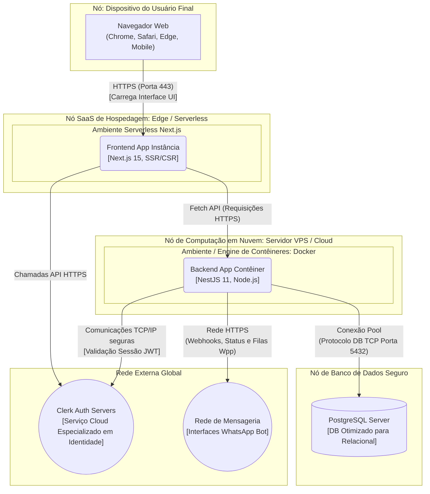

# Diagrama de Implantação - Obra Fácil

Este diagrama foca na infraestrutura de hospedagem e *deployment* dos sistemas, detalhando como os contêineres de software identificados anteriormente são de fato fisicamente executados nos ambientes de hardware, servidores em nuvem ou serviços em nuvem gerenciados (_PaaS_ / _SaaS_), cobrindo o trajeto desde o maquinário do usuário final.

## Detalhamento da Topologia de Rede e Nuvens

- **Nó - Dispositivo do Usuário:** O hardware final do cliente (desktops em escritórios ou celulares diretamente numa obra). Como o "Obra Fácil" é concebido como um Web App adaptativo, o único requisito físico é possuir um navegador atualizado executando JavaScript nativo de cliente; nenhum instalador pesado local se faz obrigatório de praxe.
- **Nó - Hospedagem Serverless (Provedor do Frontend):** O Next.js (com sua arquitetura Frontend moderna) geralmente roda hospedado em redes *Edge* (sistemas na borda) permitindo processamento Server-Side e entrega de conteúdo cacheado geograficamente próximo do originador da requisição, mantendo latências quase nulas de renderização de interface.
- **Nó - Computação do Backend (Cloud/VPS executando Docker):** Espaço provisionado com isolamento e confiabilidade. Executando o **NestJS** obrigatoriamente acoplado em contêiner **Docker**. Essa conteinerização certifica que se a imagem empacotou de forma bem-sucedida num computador, a sua execução binária será estável no Linux de produção sem conflitos de variáveis do SO host. Abstrações de Filas em Memória para retentativas/fallbacks (caso o provedor do bot falhe) residem isoladas no ciclo de vida desta conteinerização backend.
- **Nó - Banco de Dados de Produção (PostgreSQL):** Pode tratar-se de um banco conteinerizado autogerido numa VPC privada paralela, ou um DBAS (*Database As A Service*) nativo num provedor na nuvem. A sua política de acesso é rígida operando normalmente portas cruas (5432) trancadas com restrição de IPS e abertas preferivelmente apenas para o Servidor de Backend isolado.
- **As Nuvens Externas (Clerk e Mensageria WPP):** Elementos cruciais SaaS para a arquitetura do "Obra Fácil". O negócio do aplicativo é dominar e prever a gestão da construção civil. A infraestrutura dolorosa de *Single Sign On*, Criptografia de perfis na borda e rotatividade de Tokens fica estritamente na jurisdição dos clusters do sistema do Clerk. Em uníssono assíncrono, a plataforma da rede WhatsApp (meta/parceiros) administra a parte severa de rotear mensagens aos celulares.
