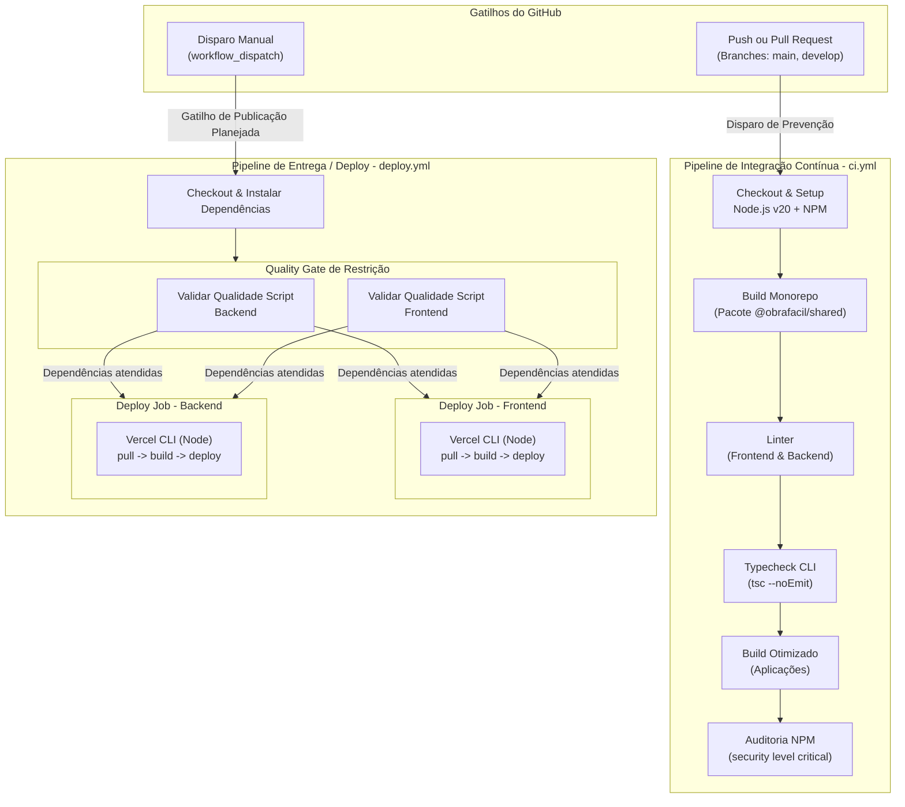

# Diagrama de Pipeline e CI/CD - Obra Fácil

Este diagrama apresenta o fluxo contínuo de Integração e Implantação (CI/CD) orquestrado pelo GitHub Actions do projeto, mapeando as rotinas de verificação de qualidade do código, empacotamento e a sua consequente publicação automatizada nos servidores utilizando a Vercel CLI.

## Detalhamento dos Workflows de Pipeline

Toda infraestrutura de DevOps declarativa está versionada isoladamente na pasta `.github/workflows/`, dividida em responsabilidades operacionais precisas:

1. **Workflow de Integração Contínua Geral (`ci.yml`):**
   - **Mecanismo de Disparo:** Totalmente reativo e orgânico. Acionado instantaneamente a cada _Push_ ou _Pull Request_ feito contra as divisões mestre do projeto (`main` e `develop`).
   - **Objetivo Central:** Atuar como um guarda rigoroso. Bloqueando preventivamente merge de linhas problemáticas no ciclo de vida de desenvolvimento, provando de que o código subido por um membro do time não está corrompido e respeita o lint estrito exigido na estrutura do monorepo, antes da sua consolidação na nuvem.
   - **Rotina Sequencial:** O pipeline configura um ambiente Ubuntu temporário, resolve todas definições do NPM (priorizando dependências em cache aceleradas), constrói o pacote central compartilhado (`@obrafacil/shared`), certifica lint e consistência de tipos TypeScript em ambas frentes (`frontend` e `backend`), processa o Build local de ambas, e finalmente aplica heurística detectora de falhas críticas nas bibliotecas instaladas (`npm audit`).

2. **Workflow de Entrega e Implantação Vercel (`deploy.yml`):**
   - **Mecanismo de Disparo:** Atualmente configurado primariamente em arquitetura _Pull/On-Demand_ manual (com `workflow_dispatch`), permitindo que a liderança gerencie momentos apropriados e intencionais de implantação em produção de entregas empacotadas. 
   - **Objetivo Central:** Prover via abstração de CLI a instalação oficial de código maduro em zonas computacionais Serverless/Edge Network da Vercel de forma previsível e auditável (produzindo outputs e status).
   - **Rotina Sequencial:** A rotina é quebrada em _Jobs_ paralelos pelo Actions. Inicializa com portas validatórias independentes do Front e Backend (que revalidam e testam instâncias). Cumprida esta fase, os deploys prosseguem: Limpam a máquina, acoplam a Vercel CLI global (v50.x), baixam metadados encriptados baseados na Branch e Tags (`--prod` ou `preview`), constroem ativamente o binário customizado (`vercel build --prebuilt`) e injetam-no por fim no *Vercel Org Server*, devolvendo a URL ativa em tela para auditoria direta.
