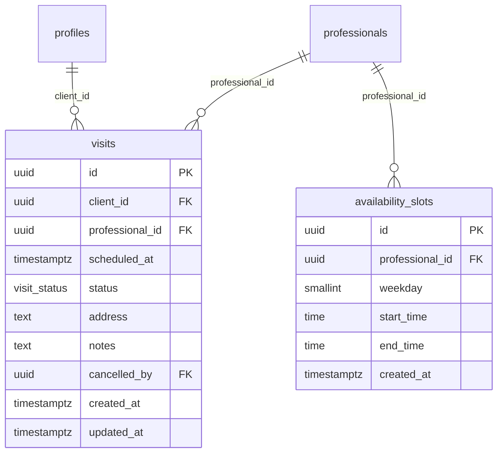

# feat: Agendamento de Visitas Tecnicas

## Overview

Implementar um fluxo completo de agendamento de visitas tecnicas entre clientes e profissionais. O profissional configura seus horarios disponiveis por dia da semana; o cliente visualiza um calendario com slots livres no perfil do profissional e agenda diretamente. Substitui o fluxo atual de "Conversar e Solicitar Visita" (que depende de chat humano-humano sem resposta) por uma acao direta e funcional.

## Problem Statement / Motivation

O botao atual "Conversar e Solicitar Visita" (`apps/frontend/src/components/ui/StartConversationButton.tsx`) abre um chat que nao funciona de ponta a ponta -- ninguem responde do outro lado. O agendamento de visitas e o passo mais critico do marketplace: sem visita tecnica, nao ha orcamento, e sem orcamento, nao ha obra. Implementar agendamento direto desbloqueaia o fluxo principal do produto.

## Proposed Solution

Componente de calendario proprio (sem Cal.com) com duas tabelas novas: `availability_slots` (disponibilidade do profissional) e `visits` (visitas agendadas). Duracao fixa de 1h, granularidade de 1h, horizonte de 30 dias.

### Decisoes Tecnicas

| Decisao | Escolha | Motivo |
|---------|---------|--------|
| Cal.com API | Rejeitado | Overhead de conta por profissional |
| Prevencao de double-booking | Partial unique index no banco | Simples, sem necessidade de transacoes |
| Tipo de horario em `availability_slots` | `time without timezone` | App opera em fuso unico (America/Sao_Paulo) |
| Granularidade de slots | 1 hora, alinhada a hora cheia | Simplicidade para v1 |
| Duracao da visita | Fixa 1h, nao armazenada | Derivada: `scheduled_at + 1h` |
| Horizonte de agendamento | 30 dias a frente | Evita complexidade de calendario longo |
| Transicao para `completed` | Manual pelo profissional | Mais simples que job automatico |
| Navegacao frontend | Tab "Visitas" dentro de `/obras` | Bottom nav ja esta cheio (5 itens) |
| Notificacoes | Fora do escopo v1 | In-app apenas |
| Endereco da visita | Campo `address` texto na visita | Profissional precisa saber onde ir |
| Lib de calendario | `react-day-picker` | Leve, customizavel, sem overhead |

## Technical Considerations

### Database Schema (Migration `002_visit_schedules.sql`)

```sql
-- Enum para status da visita
CREATE TYPE visit_status AS ENUM ('confirmed', 'completed', 'cancelled');

-- Disponibilidade semanal do profissional
CREATE TABLE availability_slots (
  id            uuid PRIMARY KEY DEFAULT uuid_generate_v4(),
  professional_id uuid NOT NULL REFERENCES professionals(id) ON DELETE CASCADE,
  weekday       smallint NOT NULL CHECK (weekday BETWEEN 0 AND 6), -- 0=domingo
  start_time    time NOT NULL,
  end_time      time NOT NULL,
  created_at    timestamptz NOT NULL DEFAULT now(),
  UNIQUE (professional_id, weekday, start_time),
  CHECK (end_time > start_time)
);

-- Visitas agendadas
CREATE TABLE visits (
  id              uuid PRIMARY KEY DEFAULT uuid_generate_v4(),
  client_id       uuid NOT NULL REFERENCES profiles(id) ON DELETE CASCADE,
  professional_id uuid NOT NULL REFERENCES professionals(id) ON DELETE CASCADE,
  scheduled_at    timestamptz NOT NULL,
  status          visit_status NOT NULL DEFAULT 'confirmed',
  address         text,
  notes           text,
  cancelled_by    uuid REFERENCES profiles(id),
  created_at      timestamptz NOT NULL DEFAULT now(),
  updated_at      timestamptz NOT NULL DEFAULT now()
);

-- Prevencao de double-booking no nivel do banco
CREATE UNIQUE INDEX idx_visits_no_double_booking
  ON visits (professional_id, scheduled_at)
  WHERE status != 'cancelled';

-- Indices para queries frequentes
CREATE INDEX idx_visits_client ON visits(client_id);
CREATE INDEX idx_visits_professional ON visits(professional_id);
CREATE INDEX idx_visits_scheduled ON visits(scheduled_at);
CREATE INDEX idx_availability_professional ON availability_slots(professional_id);

-- Trigger de updated_at (reutilizar funcao existente)
CREATE TRIGGER set_visits_updated_at
  BEFORE UPDATE ON visits
  FOR EACH ROW EXECUTE FUNCTION update_updated_at();

-- RLS
ALTER TABLE availability_slots ENABLE ROW LEVEL SECURITY;
ALTER TABLE visits ENABLE ROW LEVEL SECURITY;

CREATE POLICY availability_slots_read ON availability_slots
  FOR SELECT USING (true); -- qualquer autenticado pode ver disponibilidade

CREATE POLICY availability_slots_write ON availability_slots
  FOR ALL USING (
    professional_id IN (SELECT id FROM professionals WHERE profile_id = auth.uid())
  );

CREATE POLICY visits_participant ON visits
  FOR ALL USING (
    client_id = auth.uid()
    OR professional_id IN (SELECT id FROM professionals WHERE profile_id = auth.uid())
  );
```



### API Endpoints

| Metodo | Rota | Role | Descricao |
|--------|------|------|-----------|
| `GET` | `/v1/professionals/:id/availability` | client | Slots disponiveis do profissional |
| `GET` | `/v1/availability` | professional | Minha disponibilidade configurada |
| `PUT` | `/v1/availability` | professional | Definir/atualizar disponibilidade |
| `POST` | `/v1/visits` | client | Agendar visita |
| `GET` | `/v1/visits` | ambos | Listar minhas visitas |
| `GET` | `/v1/visits/:id` | ambos | Detalhe da visita |
| `PATCH` | `/v1/visits/:id/cancel` | ambos | Cancelar visita |
| `PATCH` | `/v1/visits/:id/complete` | professional | Marcar como concluida |

### Shared Package (`@obrafacil/shared`)

**Tipos** (`packages/shared/src/types.ts`):
```typescript
export type VisitStatus = 'confirmed' | 'completed' | 'cancelled';

export type AvailabilitySlot = {
  id: string;
  professional_id: string;
  weekday: number;
  start_time: string;
  end_time: string;
  created_at: string;
};

export type Visit = {
  id: string;
  client_id: string;
  professional_id: string;
  scheduled_at: string;
  status: VisitStatus;
  address: string | null;
  notes: string | null;
  cancelled_by: string | null;
  created_at: string;
  updated_at: string;
};

export type VisitWithProfessional = Visit & {
  professionals: ProfessionalWithProfile;
};

export type VisitWithClient = Visit & {
  client: Profile;
};
```

**Schemas** (`packages/shared/src/schemas.ts`):
```typescript
export const SetAvailabilitySchema = z.object({
  slots: z.array(z.object({
    weekday: z.number().int().min(0).max(6),
    start_time: z.string().regex(/^\d{2}:\d{2}$/),
    end_time: z.string().regex(/^\d{2}:\d{2}$/),
  })),
});

export const BookVisitSchema = z.object({
  professional_id: z.string().uuid(),
  scheduled_at: z.string().datetime(),
  address: z.string().min(1).optional(),
  notes: z.string().optional(),
});

export const CancelVisitSchema = z.object({
  reason: z.string().optional(),
});
```

### Backend Module (`apps/backend/src/modules/visits/`)

Seguir o padrao existente: `visits.module.ts`, `visits.controller.ts`, `visits.service.ts`, `visits.repository.ts`. Registrar `VisitsModule` em `app.module.ts`.

- Controller: `@ApiTags('visits')`, `@ApiBearerAuth()`, `@UseGuards(ClerkAuthGuard)`, `@Controller('v1')`.
- Role checks imperativos: `if (profile.role !== 'client') throw new ForbiddenException()`.
- Body tipado como `unknown`, parseado com Zod no service.
- Repository: SQL parametrizado via `this.db.query()`.

**Availability controller** separado ou no mesmo modulo: `@Controller('v1/availability')` para rotas do profissional, e a rota `GET /v1/professionals/:id/availability` fica no `ProfessionalsController` existente (ou no visits controller com rota explicita).

**Logica de slots disponiveis** (no service):
1. Buscar `availability_slots` do profissional para os proximos 30 dias
2. Buscar `visits` confirmadas do profissional no mesmo periodo
3. Gerar slots de 1h a partir da disponibilidade
4. Subtrair slots ja ocupados
5. Retornar lista de `{ date: string, times: string[] }`

**Prevencao de double-booking** (no repository):
- O `INSERT` na tabela `visits` vai falhar com erro de unique constraint se o slot ja estiver ocupado (gragas ao partial unique index)
- O service faz catch desse erro e retorna 409 Conflict

### Frontend

**Arquivos novos:**

| Arquivo | Tipo | Descricao |
|---------|------|-----------|
| `apps/frontend/src/components/ui/ScheduleVisitButton.tsx` | Client component | Botao "Agendar Visita" (modelo: `StartConversationButton`) |
| `apps/frontend/src/app/(app)/agendar/[professionalId]/page.tsx` | Server component | Pagina do calendario de agendamento |
| `apps/frontend/src/app/(app)/agendar/[professionalId]/AgendarClient.tsx` | Client component | Calendario interativo + selecao de horario |
| `apps/frontend/src/app/(app)/agendar/confirmacao/page.tsx` | Server component | Confirmacao pos-agendamento |
| `apps/frontend/src/app/(app)/obras/VisitasTab.tsx` | Client component | Tab de visitas dentro de /obras |

**Arquivos modificados:**

| Arquivo | Mudanca |
|---------|---------|
| `apps/frontend/src/app/(app)/profissional/[id]/page.tsx` | Adicionar `ScheduleVisitButton` ao lado do chat button no `StickyBottomCTA` |
| `apps/frontend/src/app/(app)/obras/page.tsx` | Adicionar tab "Visitas" |

**Fluxo do calendario:**
1. Cliente clica "Agendar Visita" no perfil -> navega para `/agendar/[professionalId]`
2. Pagina carrega disponibilidade via `GET /v1/professionals/:id/availability`
3. `react-day-picker` mostra mes atual com dias disponiveis destacados
4. Cliente seleciona dia -> lista de horarios aparece abaixo
5. Cliente seleciona horario -> formulario com endereco (obrigatorio) e notas (opcional)
6. Confirma -> `POST /v1/visits` -> redireciona para `/agendar/confirmacao`

**UI da disponibilidade do profissional:**
- Acessivel via `/perfil/configuracoes` ou link direto `/perfil/disponibilidade`
- Grade semanal: para cada dia da semana, profissional adiciona faixas de horario
- Simples: inputs de hora inicio/fim com botao "+" para adicionar faixa
- `PUT /v1/availability` envia todos os slots de uma vez (replace all)

**Empty states:**
- Profissional sem disponibilidade: "Este profissional ainda nao configurou sua agenda. Envie uma mensagem para combinar."
- Nenhuma visita agendada: "Voce nao tem visitas agendadas. Busque um profissional para comecar."
- Dia sem horarios: dia aparece desabilitado no calendario

**Dependencia npm:**
```bash
cd apps/frontend && npm install react-day-picker date-fns
```

## System-Wide Impact

- **Interaction graph**: Cliente clica "Agendar Visita" -> `POST /v1/visits` -> INSERT no banco -> resposta 201. Profissional visualiza via `GET /v1/visits`. Cancelamento via `PATCH /v1/visits/:id/cancel` -> UPDATE status. Nenhum callback, webhook ou side-effect alem do banco.
- **Error propagation**: Unique constraint violation no INSERT -> catch no repository -> 409 Conflict no controller -> erro exibido no frontend ("Horario ja foi reservado").
- **State lifecycle risks**: Partial unique index garante que nao ha double-booking. Cancelamento de slot de disponibilidade nao afeta visitas ja confirmadas (decisao explicita). Visitas confirmadas no passado que nao foram marcadas como concluidas ficam com status `confirmed` indefinidamente (aceitavel para v1).
- **API surface parity**: Nenhuma funcionalidade equivalente existe. A unica mudanca em superficie existente e a adicao do botao no perfil do profissional.

## Acceptance Criteria

- [x] Profissional consegue configurar horarios disponiveis por dia da semana
- [x] Cliente ve calendario com dias/horarios disponiveis no perfil do profissional
- [x] Cliente consegue agendar visita selecionando data, horario e informando endereco
- [x] Sistema impede double-booking (dois clientes no mesmo horario)
- [x] Ambos (cliente e profissional) conseguem ver suas visitas agendadas
- [x] Ambos conseguem cancelar uma visita
- [x] Profissional consegue marcar visita como concluida
- [x] Botao "Agendar Visita" aparece no perfil do profissional (ao lado ou substituindo o botao atual)
- [x] Empty states tratados: profissional sem disponibilidade, dia sem horarios
- [x] Erro de conflito (slot ocupado) tratado com mensagem amigavel

## Success Metrics

- Cliente consegue agendar visita em menos de 3 cliques apos entrar no perfil
- Zero double-bookings em producao (garantido por constraint de banco)

## Dependencies & Risks

| Risco | Mitigacao |
|-------|----------|
| `react-day-picker` pode ter breaking changes | Usar versao fixa no package.json |
| Profissionais nao configuram disponibilidade | Empty state com CTA para mensagem |
| Fuso horario incorreto | Todos os horarios em America/Sao_Paulo, `timestamptz` no banco |
| Funcao `update_updated_at()` pode nao existir | Verificar na migration 001 antes de referenciar |

## Implementation Phases

### Phase 1: Foundation (Schema + Shared)
1. Migration SQL `002_visit_schedules.sql`
2. Tipos e schemas no `@obrafacil/shared`
3. Build do shared package

### Phase 2: Backend
1. `VisitsModule` (controller, service, repository)
2. Endpoint de disponibilidade (GET/PUT)
3. Endpoints de visitas (CRUD + cancel + complete)
4. Registrar modulo no `app.module.ts`

### Phase 3: Frontend - Agendamento
1. Instalar `react-day-picker` + `date-fns`
2. `ScheduleVisitButton` no perfil do profissional
3. Pagina `/agendar/[professionalId]` com calendario
4. Pagina de confirmacao
5. Empty states

### Phase 4: Frontend - Gestao
1. UI de configuracao de disponibilidade do profissional
2. Tab "Visitas" na pagina de obras
3. Detalhe da visita + acoes (cancelar, concluir)

## Fora do Escopo (v1)

- Chat com IA / chatbot
- Notificacoes push/email/SMS
- Visitas recorrentes
- Duracao variavel por tipo de servico
- Buffer entre visitas
- Politica de cancelamento com restricao de tempo
- Tratamento de no-show
- Integracao visita -> obra automatica
- Reagendamento (usuario cancela e reagenda manualmente)

## Sources & References

- Padrao de modulo backend: `apps/backend/src/modules/orders/` (controller, service, repository)
- Padrao de botao interativo: `apps/frontend/src/components/ui/StartConversationButton.tsx`
- Padrao de pagina com client component: `apps/frontend/src/app/(app)/profissional/[id]/`
- Schema existente: `supabase/migrations/001_initial_schema.sql`
- Tipos compartilhados: `packages/shared/src/types.ts`
- Schemas Zod: `packages/shared/src/schemas.ts`
- User stories de agendamento: `docs/01-produto/user_stories.md` (linhas 29-34)
- Design system cores: `apps/frontend/tailwind.config.ts` (trust, brand, savings)
