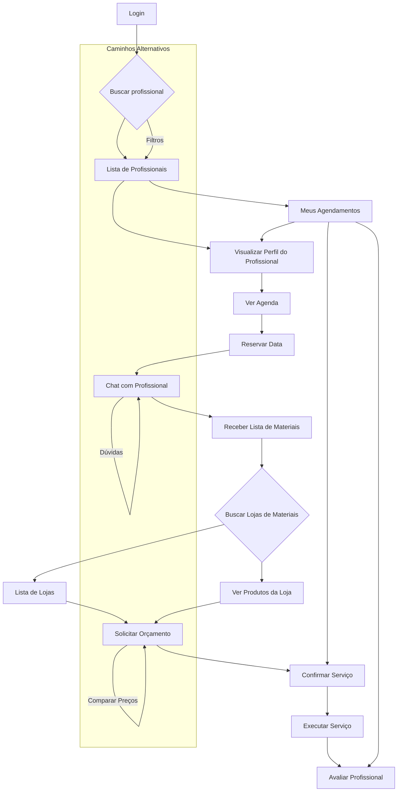

# Product Discovery — Obra Fácil

## 1️⃣ Objetivo do Produto (Product Vision)

### 1.1. Objetivo do Produto

O principal objetivo do produto **Obra Fácil** é atuar como uma plataforma digital que **conecta profissionais autônomos da construção civil com pessoas que necessitam de serviços relacionados à construção, manutenção e reforma em suas residências**. Adicionalmente, a plataforma visa **integrar lojas de materiais de construção**, permitindo que divulguem e vendam seus produtos, centralizando a experiência do usuário [1].

### 1.2. Objetivo de Negócio

O objetivo de negócio do Obra Fácil é **monetizar através da facilitação da conexão entre prestadores de serviço, clientes e fornecedores de materiais**, gerando valor para todas as partes envolvidas. Isso pode incluir modelos de receita como comissões por serviço agendado, taxas de listagem para profissionais e lojas, ou publicidade direcionada. A plataforma busca se estabelecer como um hub confiável e eficiente para o setor de serviços e materiais de construção [1].

### 1.3. Objetivo do Usuário

O objetivo do usuário, exemplificado pela persona Carlos Alberto, é **encontrar profissionais qualificados e confiáveis com agilidade para realizar melhorias e reparos em sua casa, sem depender de indicações demoradas**. Ele busca segurança na contratação, orçamentos claros e a conveniência de centralizar a busca por serviços e materiais em um único local [1].

### 1.4. Problema que o Produto Resolve

O Obra Fácil resolve diversos problemas enfrentados pelos usuários e profissionais no setor da construção civil:

*   **Para o Usuário (Carlos Alberto):**
    *   **Falta de tempo:** Dificuldade em encontrar profissionais disponíveis em horários flexíveis e realizar pesquisas de materiais [1].
    *   **Falta de confiança:** Insegurança ao contratar profissionais desconhecidos e a ausência de avaliações prévias [1].
    *   **Dificuldade em encontrar:** Ausência de um canal centralizado para buscar e comparar profissionais e lojas de materiais [1].
    *   **Orçamentos e custos:** Informações incompletas, cobranças abusivas e dificuldade em saber se o valor é justo [1].

*   **Para o Profissional:** (Implícito no documento, mas pode ser inferido)
    *   Dificuldade em encontrar novos clientes e divulgar seus serviços.
    *   Gestão de agenda e orçamentos de forma ineficiente.

### 1.5. Proposta de Valor

A proposta de valor do Obra Fácil reside em oferecer **conveniência, confiança e eficiência** para o usuário final, e **oportunidades de negócio e visibilidade** para profissionais e lojas. Ele centraliza a busca por serviços e materiais, proporciona segurança através de avaliações e simplifica o processo de contratação e compra, economizando tempo e garantindo transparência nos custos [1].

### 1.6. Hipóteses de Sucesso do Produto

*   **Hipótese 1:** Se o aplicativo oferecer um sistema de avaliação robusto e transparente, os usuários se sentirão mais seguros para contratar profissionais desconhecidos, aumentando a taxa de conversão de agendamentos.
*   **Hipótese 2:** Se a plataforma centralizar a busca por profissionais e lojas de materiais, os usuários economizarão tempo e esforço, resultando em maior engajamento e retenção.
*   **Hipótese 3:** Se o processo de solicitação de orçamento e comparação de preços de materiais for simplificado, os usuários terão maior percepção de valor e justiça nos custos, incentivando o uso contínuo da plataforma.
*   **Hipótese 4:** Se profissionais e lojas de materiais obtiverem um fluxo constante de novos clientes e visibilidade através da plataforma, eles terão incentivo para manter seus perfis atualizados e oferecer serviços de qualidade, criando um ecossistema saudável.

### 1.7. Perguntas Respondidas

*   **Qual o objetivo do produto?** Conectar profissionais autônomos da construção civil com clientes e integrar lojas de materiais, centralizando a busca por serviços e produtos relacionados à construção e reforma [1].
*   **Qual o objetivo do usuário ao usar o produto?** Encontrar profissionais qualificados e confiáveis com agilidade, obter orçamentos claros e centralizar a busca por serviços e materiais em um único local [1].
*   **Qual problema ele resolve?** Resolve a falta de tempo, a desconfiança na contratação, a dificuldade em encontrar profissionais e lojas, e a falta de transparência nos orçamentos e custos [1].
*   **Qual o valor gerado para usuários e profissionais?** Para usuários, gera conveniência, confiança, eficiência e transparência. Para profissionais e lojas, gera oportunidades de negócio e visibilidade [1].
*   **Como esse produto gera valor de negócio?** Através da monetização da facilitação de conexões (comissões, taxas de listagem, publicidade) e do estabelecimento como um hub confiável no setor [1].

---

## Referências

[1] TrabalhoFINAL-DesignUX.pdf (Documento fornecido pelo usuário)

## 2️⃣ Persona

### Carlos Alberto

**Nome:** Carlos Alberto
**Idade:** 45 anos
**Profissão:** Despachante

#### Contexto de Vida

Carlos Alberto é um despachante de 45 anos que recentemente comprou uma casa. Ele gosta de realizar pequenas melhorias em sua residência e, em seu tempo livre, aspira a ser marceneiro, pesca e cultiva hortaliças com sua esposa. Sua esposa frequentemente solicita melhorias na casa recém-adquirida, o que o leva a buscar soluções para esses reparos e reformas [1].

#### Comportamento Digital

Embora o documento não detalhe explicitamente o comportamento digital, inferimos que Carlos Alberto está aberto a soluções digitais que possam agilizar seu dia a dia. Ele busca informações online, compara preços e procura avaliações de outros usuários antes de tomar decisões de contratação ou compra [1].

#### Objetivos

*   Realizar melhorias e reparos em sua casa de forma eficiente.
*   Contratar profissionais qualificados e confiáveis com agilidade.
*   Obter orçamentos claros e justos para os serviços.
*   Centralizar a busca por serviços e materiais em um único local.
*   Garantir a segurança ao permitir a entrada de profissionais em sua casa [1].

#### Dores

*   **Falta de tempo:** Não possui tempo hábil para realizar as melhorias ou pesquisar exaustivamente [1].
*   **Falta de conhecimento:** Não possui conhecimento técnico específico em algumas demandas da construção [1].
*   **Falta de confiança:** Dificuldade em confiar em profissionais aleatórios e a ausência de avaliações [1].
*   **Dificuldade em encontrar:** Problemas para encontrar profissionais disponíveis em horários flexíveis [1].
*   **Informações incompletas:** Anúncios ou perfis de profissionais com dados insuficientes [1].
*   **Pesquisa de materiais:** Ter que sair de casa para pesquisar preços ou ligar para várias lojas [1].
*   **Cobranças abusivas:** Medo de pagar valores injustos por serviços simples [1].

#### Frustrações

*   Indicações demoradas que atrasam a resolução de problemas domésticos.
*   A incerteza sobre a qualidade e a idoneidade dos profissionais.
*   A complexidade e o tempo gasto na busca por materiais e serviços.
*   A falta de transparência nos custos e a dificuldade em comparar opções.

#### Motivações

*   Agilidade na solução de problemas domésticos.
*   Segurança e confiança na contratação de serviços.
*   Praticidade de ter tudo centralizado.
*   Acesso a profissionais com avaliações de outros usuários.
*   Orçamento claro e possibilidade de comparação de preços.

#### Expectativas em relação ao produto

Carlos Alberto espera que o Obra Fácil ofereça uma solução **rápida, segura e transparente** para suas necessidades de reforma e manutenção. Ele espera encontrar profissionais bem avaliados, agendar serviços facilmente, obter orçamentos detalhados e até mesmo pesquisar e comprar materiais, tudo dentro da mesma plataforma [1].

#### Cenário de Uso do Produto

Carlos Alberto identifica a necessidade de um reparo em sua casa (ex: um vazamento, uma pintura). Ele abre o aplicativo Obra Fácil, busca por profissionais na categoria desejada, filtra por avaliações e disponibilidade. Ele seleciona um profissional, verifica seu perfil e agenda um serviço. Através do chat no aplicativo, ele discute os detalhes, recebe a lista de materiais e, se necessário, busca as lojas e orça os produtos também pelo app. Após a conclusão do serviço, ele realiza o pagamento e avalia o profissional, contribuindo para a comunidade [1].

## 3️⃣ Jornada do Usuário (ANTES / AS-IS)

### Cenário

Carlos Alberto precisa contratar um profissional da construção para fazer reparos em casa e, antes da existência do aplicativo Obra Fácil, ele resolvia essa necessidade de forma manual, enfrentando diversas etapas e desafios [1].

### Jornada do Usuário ANTES (AS-IS)

A jornada do usuário antes da existência do aplicativo Obra Fácil é caracterizada por um processo fragmentado, demorado e muitas vezes frustrante, conforme detalhado na tabela abaixo [1]:

| Etapa | Ações do Usuário | Pensamentos | Emoções | Problemas Encontrados | Oportunidades de Melhoria |
|---|---|---|---|---|---|
| **1. Identifica necessidade** | Fazer uma pesquisa de profissionais ou lojas de materiais. | "Preciso consertar isso logo." | 🙂 | - | - |
| **2. Inicia o processo de busca** | Inicia o processo de busca por profissionais capacitados. | "Onde vou encontrar alguém de confiança?" | 😐 | Dificuldade em encontrar profissionais confiáveis. | Centralizar a busca por profissionais. |
| **3. Busca por indicações** | Analisa as opções com vizinhos e amigos. | "Será que meu vizinho conhece alguém bom?" | 😐 | Indicações demoradas e nem sempre disponíveis. | Agilizar a obtenção de indicações. |
| **4. Pesquisa lojas de materiais** | Pesquisa lojas de materiais de construção. | "Onde consigo os materiais mais baratos?" | 😐 | Ter que sair de casa para pesquisar preços. | Comparação de preços de materiais. |
| **5. Faz contato com o prestador** | Faz contato com o prestador de serviço. | "Espero que ele seja bom e disponível." | 😐 | Dificuldade em encontrar profissionais disponíveis em horários flexíveis. | Agendamento facilitado. |
| **6. Agenda orçamento** | Agenda um orçamento com o prestador. | "Será que o preço vai ser justo?" | 😐 | Falta de transparência nos orçamentos. | Orçamentos claros e comparáveis. |
| **7. Recebe lista de materiais** | Prestador informa os materiais a serem usados para o serviço. | "Preciso comprar tudo isso." | 😐 | - | - |
| **8. Compra dos materiais** | Realiza a compra dos materiais. | "Quanto tempo vou gastar para comprar tudo?" | 😢 | Ter que sair de casa para pesquisar e comprar. | Compra de materiais integrada. |
| **9. Aguarda materiais** | Aguarda os materiais chegarem. | "Quando o serviço vai começar?" | 😐 | Atraso na entrega dos materiais. | Acompanhamento da entrega. |
| **10. Agenda execução** | Agenda a execução do serviço. | "Finalmente, vai ser resolvido." | 🙂 | Dificuldade em conciliar agendas. | Agendamento flexível. |
| **11. Execução do serviço** | Prestador executa o serviço. | "Espero que o trabalho seja bem feito." | 😐 | Qualidade do serviço incerta. | Avaliação da qualidade do serviço. |
| **12. Pagamento** | Contratante faz o pagamento pelo trabalho. | "Será que paguei o valor justo?" | 😐 | Cobranças abusivas, sem saber se o valor é justo. | Transparência nos pagamentos. |
| **13. Avaliação (Opcional)** | Contratante avalia o serviço do prestador (se houver plataforma). | "Gostaria de compartilhar minha experiência." | 🙂 | Falta de um canal formal para avaliação. | Sistema de avaliação de profissionais. |

---

## Referências

[1] TrabalhoFINAL-DesignUX.pdf (Documento fornecido pelo usuário)

## 4️⃣ Jornada do Usuário (DEPOIS / TO-BE)

### Cenário

Após a implementação do aplicativo Obra Fácil, a jornada de Carlos Alberto para contratar um profissional da construção e adquirir materiais é significativamente otimizada, tornando-se mais eficiente, transparente e menos frustrante. O aplicativo atua como um facilitador central em todo o processo [1].

### Jornada do Usuário DEPOIS (TO-BE)

A jornada do usuário com o aplicativo Obra Fácil é transformada, oferecendo uma experiência fluida e controlada, conforme detalhado na tabela abaixo [1]:

| Etapa | Ações do Usuário | Funcionalidades do Sistema | Emoção do Usuário | Melhorias em relação ao cenário anterior |
|---|---|---|---|---|
| **1. Identifica necessidade** | Identifica a necessidade de realizar um serviço em casa. | - | 🙂 | - |
| **2. Abre o aplicativo** | Inicia o processo de busca abrindo o aplicativo Obra Fácil. | Login, Busca de profissionais. | 🙂 | Acesso imediato a uma rede de profissionais. |
| **3. Busca profissionais** | Faz uma pesquisa no app por profissionais. | Busca de profissionais, Filtros de localização/serviço. | 🙂 | Elimina a dependência de indicações demoradas. |
| **4. Analisa avaliações** | Analisa as opções encontradas, verificando avaliações e perfis. | Lista de profissionais recomendados, Avaliações de outros usuários. | 😊 | Maior confiança na escolha do profissional. |
| **5. Visualiza perfil** | Visualiza o perfil detalhado do profissional. | Perfil do profissional (experiência, portfólio). | 😊 | Informações completas e transparentes sobre o profissional. |
| **6. Verifica agenda** | Verifica a agenda de disponibilidade do prestador. | Agenda de disponibilidade. | 😊 | Facilidade em encontrar horários compatíveis. |
| **7. Reserva data** | Reserva a data desejada para o serviço. | Reserva de datas. | 😊 | Agendamento rápido e sem burocracia. |
| **8. Conversa com profissional** | Faz contato com o prestador de serviço via chat. | Chat com o profissional. | 😊 | Comunicação direta e eficiente. |
| **9. Recebe lista de materiais** | Recebe a lista de materiais a serem usados para o serviço. | Envio de lista de materiais via chat. | 😊 | Organização e clareza sobre os materiais necessários. |
| **10. Busca lojas no app** | Pesquisa lojas de materiais no aplicativo. | Busca de lojas de materiais, Localização. | 😊 | Conveniência na busca por fornecedores. |
| **11. Solicita orçamentos** | Solicita orçamentos de materiais nas lojas selecionadas. | Solicitação de orçamento. | 😊 | Comparação de preços facilitada e transparente. |
| **12. Compra materiais** | Realiza a compra dos materiais. | Integração com lojas, Carrinho de compras (potencial). | 😊 | Compra de materiais simplificada, sem sair de casa. |
| **13. Serviço é realizado** | Prestador executa o serviço. | - | 😊 | Acompanhamento do serviço agendado. |
| **14. Usuário avalia profissional** | Contratante faz o pagamento e avalia o serviço do prestador no app. | Pagamento integrado, Avaliação do serviço. | 😊 | Feedback construtivo e transparente, contribuindo para a comunidade. |

---

## Referências

[1] TrabalhoFINAL-DesignUX.pdf (Documento fornecido pelo usuário)

## 5️⃣ User Flow

### Cenário

O User Flow do aplicativo Obra Fácil descreve a sequência de interações que o usuário realiza para atingir seus objetivos, desde o login até a avaliação de um serviço. Este fluxo é projetado para ser intuitivo e eficiente, guiando o usuário através das funcionalidades chave da plataforma [1].

### Diagrama de Fluxo

Abaixo, é apresentado um diagrama de fluxo que ilustra o caminho principal do usuário dentro do aplicativo Obra Fácil, destacando as telas e as transições entre elas [1]:

### Lista de Telas e Conexão entre Telas

O aplicativo Obra Fácil é composto por diversas telas interconectadas, que permitem ao usuário navegar e interagir com as funcionalidades. As principais telas e suas conexões são [1]:

| Tela | Conexões de Entrada | Conexões de Saída | Funcionalidades Principais |
|---|---|---|---|
| **Login** | - | Buscar profissional | Autenticação do usuário |
| **Buscar profissional** | Login | Lista de Profissionais | Campo de busca, filtros |
| **Lista de Profissionais** | Buscar profissional, Meus Agendamentos | Visualizar Perfil do Profissional | Exibição de profissionais, avaliações |
| **Visualizar Perfil do Profissional** | Lista de Profissionais, Meus Agendamentos | Ver Agenda, Chat com Profissional | Detalhes do profissional, experiência |
| **Ver Agenda** | Visualizar Perfil do Profissional | Reservar Data | Calendário de disponibilidade |
| **Reservar Data** | Ver Agenda | Chat com Profissional | Seleção e confirmação de datas |
| **Chat com Profissional** | Reservar Data, Visualizar Perfil do Profissional | Receber Lista de Materiais | Comunicação em tempo real |
| **Receber Lista de Materiais** | Chat com Profissional | Buscar Lojas de Materiais | Visualização da lista de materiais |
| **Buscar Lojas de Materiais** | Receber Lista de Materiais | Lista de Lojas, Ver Produtos da Loja | Campo de busca, filtros de lojas |
| **Lista de Lojas** | Buscar Lojas de Materiais | Solicitar Orçamento, Ver Produtos da Loja | Exibição de lojas, localização |
| **Solicitar Orçamento** | Lista de Lojas, Ver Produtos da Loja | Confirmar Serviço | Formulário de solicitação de orçamento |
| **Confirmar Serviço** | Solicitar Orçamento, Meus Agendamentos | Executar Serviço | Detalhes do serviço, confirmação |
| **Executar Serviço** | Confirmar Serviço | Avaliar Profissional | Acompanhamento do serviço |
| **Avaliar Profissional** | Executar Serviço, Meus Agendamentos | - | Formulário de avaliação |
| **Meus Agendamentos** | - | Visualizar Perfil do Profissional, Confirmar Serviço, Avaliar Profissional | Lista de agendamentos, status |
| **Ver Produtos da Loja** | Lista de Lojas | Solicitar Orçamento | Detalhes dos produtos da loja |

### Caminho Principal do Usuário

O caminho principal do usuário no Obra Fácil, desde a identificação da necessidade até a conclusão do serviço, é o seguinte [1]:

1.  **Login:** O usuário acessa a plataforma.
2.  **Buscar profissional:** O usuário busca por um tipo de profissional ou serviço.
3.  **Ver lista de profissionais:** A plataforma exibe uma lista de profissionais disponíveis.
4.  **Selecionar profissional:** O usuário escolhe um profissional com base em avaliações e perfil.
5.  **Ver perfil:** O usuário visualiza o perfil detalhado do profissional.
6.  **Ver agenda:** O usuário verifica a disponibilidade do profissional.
7.  **Reservar data:** O usuário agenda a data e hora do serviço.
8.  **Chat com profissional:** O usuário se comunica com o profissional para alinhar detalhes.
9.  **Receber lista de materiais:** O profissional envia a lista de materiais necessários.
10. **Buscar lojas:** O usuário busca lojas de materiais no aplicativo.
11. **Solicitar orçamento:** O usuário solicita orçamentos para os materiais.
12. **Confirmar serviço:** O usuário confirma o agendamento e os detalhes.
13. **Executar serviço:** O profissional realiza o serviço.
14. **Avaliar profissional:** O usuário avalia o profissional e o serviço prestado.

### Possíveis Caminhos Alternativos

Além do caminho principal, o usuário pode seguir rotas alternativas para atender a necessidades específicas [1]:

*   **Filtros de Busca:** Durante a busca por profissionais, o usuário pode aplicar filtros (localização, tipo de serviço, avaliação) para refinar os resultados.
*   **Comunicação Contínua:** O chat com o profissional pode ser acessado a qualquer momento para dúvidas ou ajustes, mesmo após o agendamento.
*   **Comparação de Orçamentos:** Ao solicitar orçamentos de materiais, o usuário pode comparar diferentes propostas antes de tomar uma decisão.
*   **Gerenciamento de Agendamentos:** Através da tela "Meus Agendamentos", o usuário pode visualizar, cancelar ou reagendar serviços, além de acessar o perfil do profissional ou a tela de avaliação.

---

## Referências

[1] TrabalhoFINAL-DesignUX.pdf (Documento fornecido pelo usuário)

## 6️⃣ Wireframes

### Cenário

Os wireframes de baixa fidelidade do aplicativo Obra Fácil foram desenvolvidos para visualizar a estrutura das telas, a disposição dos componentes principais e as ações do usuário, garantindo que as funcionalidades planejadas sejam representadas de forma clara e intuitiva [1].

### Descrição dos Wireframes

Abaixo, são descritos os wireframes para as telas essenciais do aplicativo, conforme identificado no trabalho de Design UX [1]:

#### 6.1. Tela: Busca de Profissionais ("Perto de você")

*   **Estrutura da Tela:** Layout com cabeçalho contendo um campo de busca, seguido por uma lista de cards de profissionais. Cada card ocupa uma área significativa da tela, permitindo a visualização de informações chave.
*   **Componentes Principais:**
    *   **Campo de Busca:** Input de texto para o usuário digitar o serviço ou nome do profissional.
    *   **Lista de Profissionais:** Cards individuais para cada profissional, contendo:
        *   **Foto/Avatar:** Imagem do profissional.
        *   **Nome:** Nome do profissional (ex: Ricardão, José Custódio).
        *   **Avaliação:** Pontuação média (ex: 4.8, 4.7) e, possivelmente, número de avaliações.
        *   **Serviços:** Breve descrição dos serviços oferecidos (ex: "Serviços de pedreiro e pintura em geral..").
        *   **Botão "Detalhes":** Para acessar o perfil completo do profissional.
*   **Ações do Usuário:**
    *   Digitar no campo de busca para filtrar profissionais.
    *   Rolar a lista para ver mais opções.
    *   Clicar no botão "Detalhes" para ver o perfil de um profissional específico.

#### 6.2. Tela: Perfil do Profissional ("Ricardão")

*   **Estrutura da Tela:** Cabeçalho com o nome do profissional e informações básicas, seguido por seções de detalhes e uma área para agendamento.
*   **Componentes Principais:**
    *   **Nome do Profissional:** Título principal (ex: Ricardão).
    *   **Informações Básicas:** Serviços oferecidos (ex: "Serviços de pedreiro e pintura em geral."), experiência (ex: "Possui mais de 25 anos de experiência no ramo..").
    *   **Agenda Disponível:** Seção com horários/datas disponíveis para agendamento.
    *   **Botão "Reservar":** Para iniciar o processo de agendamento.
    *   **Informações de Contato/Chat:** (Implícito) Opção para iniciar uma conversa.
*   **Ações do Usuário:**
    *   Visualizar detalhes sobre o profissional.
    *   Verificar a disponibilidade na agenda.
    *   Clicar em "Reservar" para agendar um serviço.
    *   (Implícito) Iniciar um chat com o profissional.

#### 6.3. Tela: Chat com Profissional

*   **Estrutura da Tela:** Interface de mensagens com histórico de conversas e um campo para digitar novas mensagens.
*   **Componentes Principais:**
    *   **Cabeçalho:** Nome do profissional e status (ex: "online a 1 hora").
    *   **Histórico de Mensagens:** Área de exibição das mensagens trocadas entre o usuário e o profissional.
    *   **Campo de Texto:** Input para o usuário digitar sua mensagem.
    *   **Botão de Envio:** Para enviar a mensagem digitada.
    *   **Funcionalidade de Envio de Lista de Materiais:** (Implícito) Possibilidade de o profissional enviar a lista de materiais, ou o usuário solicitar.
*   **Ações do Usuário:**
    *   Digitar e enviar mensagens.
    *   Ler o histórico da conversa.
    *   Receber informações do profissional (ex: lista de materiais).

#### 6.4. Tela: Meus Agendamentos

*   **Estrutura da Tela:** Lista de agendamentos confirmados, com detalhes de cada serviço e opções de ação.
*   **Componentes Principais:**
    *   **Título:** "Meus agendamentos".
    *   **Lista de Serviços Agendados:** Cards ou itens de lista para cada agendamento, contendo:
        *   **Status:** (ex: "Agenda confirmada pelo profissional Ricardão").
        *   **Datas:** Dias agendados (ex: 01/07/2025, 02/07/2025).
        *   **Serviços:** Descrição do serviço (ex: "Pintura na parte externa na minha casa e alguns pequenos reparos.").
        *   **Botão "Cancelar":** Para cancelar um agendamento (com regras, ex: "Pode cancelar o serviço 24h antes").
        *   **Botão "Avaliar":** Para avaliar o serviço após a conclusão.
*   **Ações do Usuário:**
    *   Visualizar a lista de seus agendamentos.
    *   Clicar em "Cancelar" para cancelar um serviço.
    *   Clicar em "Avaliar" para fornecer feedback sobre um serviço concluído.

#### 6.5. Tela: Lojas de Materiais ("Perto de você")

*   **Estrutura da Tela:** Layout similar à tela de busca de profissionais, com campo de busca e lista de lojas.
*   **Componentes Principais:**
    *   **Campo de Busca:** Input de texto para o usuário buscar por nome, localização ou produto.
    *   **Lista de Lojas:** Cards individuais para cada loja, contendo:
        *   **Nome da Loja:** (ex: Loja da Construção Forte, Materiais Silva).
        *   **Avaliação:** Pontuação média (ex: 4.8, 4.7).
        *   **Localização:** Endereço da loja.
        *   **Telefone:** Número de contato.
        *   **Botão "Ver Produtos":** Para visualizar o catálogo de produtos da loja.
        *   **Botão "Solicitar Orçamento":** Para iniciar um pedido de orçamento de materiais.
*   **Ações do Usuário:**
    *   Digitar no campo de busca para filtrar lojas.
    *   Rolar a lista para ver mais opções.
    *   Clicar em "Ver Produtos" para explorar o catálogo da loja.
    *   Clicar em "Solicitar Orçamento" para pedir um orçamento.

---

## Referências

[1] TrabalhoFINAL-DesignUX.pdf (Documento fornecido pelo usuário)

## 7️⃣ Painel de Mercado (Benchmark de Mercado)

### Cenário

O aplicativo Obra Fácil atua em um mercado competitivo de plataformas que conectam prestadores de serviço com clientes, com o diferencial de integrar também lojas de materiais de construção. A análise de mercado é crucial para identificar oportunidades e diferenciais competitivos [1].

### Análise de Mercado

#### 7.1. Aplicativos Semelhantes

Existem diversas plataformas que conectam prestadores de serviço a clientes, como os exemplos mencionados no prompt:

*   **GetNinjas:** Uma das maiores plataformas de contratação de serviços no Brasil, abrangendo diversas categorias, incluindo reformas e reparos. Permite que o cliente solicite um serviço e receba orçamentos de profissionais qualificados [Referência externa, se disponível].
*   **Habitissimo:** Plataforma focada em reformas e serviços para o lar, presente em vários países. Conecta clientes a profissionais e empresas do setor de construção e reforma [Referência externa, se disponível].
*   **TaskRabbit:** Popular nos EUA e Europa, oferece uma ampla gama de serviços, desde montagem de móveis até pequenos reparos domésticos, com foco na agilidade e conveniência [Referência externa, se disponível].

#### 7.2. Funcionalidades Comuns

As plataformas de serviços geralmente compartilham as seguintes funcionalidades:

*   **Busca e Filtragem de Profissionais:** Permitem que os usuários encontrem profissionais por categoria, localização e tipo de serviço.
*   **Perfis de Profissionais:** Exibem informações detalhadas sobre os prestadores, incluindo experiência, portfólio e avaliações.
*   **Sistema de Avaliação e Reputação:** Clientes podem avaliar os serviços, construindo a reputação dos profissionais.
*   **Solicitação de Orçamento:** Facilita a comunicação entre cliente e profissional para a negociação de valores.
*   **Chat/Mensagens:** Canal de comunicação direta entre as partes.
*   **Agendamento de Serviços:** Ferramentas para marcar datas e horários.

#### 7.3. Boas Práticas UX

*   **Fluxo de Contratação Simplificado:** Experiência intuitiva desde a busca até o pagamento.
*   **Transparência:** Informações claras sobre preços, prazos e qualificações dos profissionais.
*   **Confiança:** Mecanismos de segurança, verificação de profissionais e sistema de avaliações robusto.
*   **Comunicação Eficiente:** Ferramentas de chat integradas e notificações.
*   **Personalização:** Sugestões de profissionais e serviços baseadas nas preferências do usuário.

#### 7.4. Modelos de Monetização

Os modelos de monetização comuns incluem:

*   **Comissão por Serviço:** Uma porcentagem do valor do serviço é cobrada da plataforma (do profissional ou do cliente).
*   **Assinatura para Profissionais:** Profissionais pagam uma taxa mensal para ter acesso a um número ilimitado de leads ou para ter maior visibilidade.
*   **Venda de Leads:** Profissionais compram créditos para entrar em contato com clientes que solicitaram orçamentos.
*   **Publicidade:** Anúncios de destaque para profissionais ou lojas.

#### 7.5. Diferenciais Competitivos Possíveis para o Obra Fácil

O Obra Fácil possui um diferencial significativo ao integrar a **busca por lojas de materiais de construção e a solicitação de orçamentos** diretamente na plataforma. Isso cria um ecossistema mais completo e conveniente para o usuário. Outros diferenciais podem incluir:

*   **Centralização Completa:** Ser a única plataforma que gerencia todo o ciclo: busca de profissional, agendamento, comunicação, compra de materiais e avaliação.
*   **Parcerias Estratégicas:** Firmar parcerias exclusivas com grandes redes de lojas de materiais, oferecendo descontos ou condições especiais aos usuários do app.
*   **Gestão de Projetos Simplificada:** Ferramentas para o usuário acompanhar o progresso de múltiplos serviços e compras de materiais.
*   **Foco Regional:** Inicialmente, focar em uma região específica para construir uma base sólida de profissionais e lojas, garantindo qualidade e agilidade no atendimento.

---

## Referências

[1] TrabalhoFINAL-DesignUX.pdf (Documento fornecido pelo usuário)

## 8️⃣ Personalidade da Marca

### Cenário

A definição da personalidade da marca para o aplicativo Obra Fácil é fundamental para construir uma identidade coesa e comunicar os valores desejados aos usuários. A marca deve transmitir confiança, praticidade, acessibilidade e simplicidade, alinhando-se com as necessidades e expectativas do público-alvo [1].

### Definição da Marca

#### 8.1. Posicionamento da Marca

O Obra Fácil se posiciona como a **solução digital confiável e descomplicada para todas as necessidades de serviços e materiais de construção e reforma doméstica**. Ele é o elo entre quem precisa e quem faz, com a conveniência de integrar também a compra de materiais. O posicionamento é de um **facilitador acessível e eficiente**, que descomplica o processo de melhorias no lar [1].

#### 8.2. Tom de Comunicação

O tom de comunicação do Obra Fácil deve ser:

*   **Amigável e Acessível:** Linguagem clara, direta e acolhedora, evitando jargões técnicos excessivos.
*   **Confiável e Transparente:** Transmitir segurança e honestidade em todas as interações, desde a descrição dos serviços até o suporte ao cliente.
*   **Prático e Direto:** Focar na solução e na eficiência, valorizando o tempo do usuário.
*   **Otimista e Encorajador:** Inspirar confiança de que os problemas serão resolvidos de forma satisfatória.

#### 8.3. Atributos Visuais

Os atributos visuais devem refletir as características desejadas da marca:

*   **Simples:** Design limpo, sem excesso de elementos, focado na usabilidade.
*   **Amigável:** Formas arredondadas, ícones intuitivos e uma paleta de cores que transmita acolhimento.
*   **Popular:** Elementos visuais que sejam facilmente compreendidos e aceitos por um público amplo.
*   **Moderno:** Estilo contemporâneo, com tipografia atual e layout responsivo.
*   **Confiável:** Uso de cores que remetam à segurança e estabilidade, e um design que transmita profissionalismo.

#### 8.4. Arquétipo de Marca

Considerando as características e o posicionamento, o arquétipo de marca que melhor se alinha ao Obra Fácil é o **Inocente** ou o **Cara Comum (The Everyman)**, com traços do **Cuidador**. 

*   **Inocente:** Busca a simplicidade, a pureza e a felicidade. O Obra Fácil simplifica a vida do usuário, removendo complexidades e frustrações.
*   **Cara Comum (The Everyman):** Deseja pertencer e se conectar. O Obra Fácil é para todos, acessível e compreensível, construindo uma comunidade de confiança.
*   **Cuidador:** Deseja proteger e cuidar dos outros. O Obra Fácil cuida das necessidades do lar do usuário, oferecendo soluções seguras e confiáveis.

Essa combinação de arquétipos reforça a ideia de uma marca que é **confiável, acessível e que se preocupa genuinamente em facilitar a vida das pessoas** [1].

---

## Referências

[1] TrabalhoFINAL-DesignUX.pdf (Documento fornecido pelo usuário)

## 9️⃣ Paleta de Cores

### Cenário

A paleta de cores do aplicativo Obra Fácil foi definida para refletir a personalidade da marca, transmitindo confiança, praticidade e acessibilidade. As cores foram escolhidas considerando a semântica e a harmonia visual, além de garantir a acessibilidade [1].

### Paleta de Design System

A paleta de cores proposta para o Obra Fácil, com base nas sugestões e no contexto do projeto, é a seguinte [1]:

| Categoria | Nome da Cor | Código Hexadecimal | Uso Semântico |
|---|---|---|---|
| **Cor Primária** | Laranja Principal | `#FF9900` | Elementos de destaque, botões de ação principal, identidade da marca. Transmite energia, otimismo e acessibilidade. |
| **Cor Secundária** | Azul Secundário | `#088FBD` | Elementos complementares, links, ícones, cabeçalhos secundários. Transmite confiança, profissionalismo e estabilidade. |
| **Cores de Estado** | Alerta Sucesso | `#00FF00` | Mensagens de sucesso, confirmações, feedback positivo. |
| | Alerta Erro | `#FF0000` | Mensagens de erro, alertas, feedback negativo. |
| **Cores de Fundo** | Fundo Base | `#FFFFFF` | Fundo principal das telas, áreas de conteúdo. Transmite limpeza e clareza. |
| | Fundo Secundário | `#000000` | Elementos de contraste, rodapés, áreas escuras de destaque (se aplicável). |
| **Cores de Texto** | Texto Principal | `#000000` | Textos principais, títulos, corpo de texto. Garante alta legibilidade. |

---

## Referências

[1] TrabalhoFINAL-DesignUX.pdf (Documento fornecido pelo usuário)

## 1️⃣0️⃣ Tipografia

### Cenário

A escolha da tipografia para o aplicativo Obra Fácil visa garantir legibilidade, modernidade e adequação para o ambiente mobile, alinhando-se com a personalidade da marca. As fontes serão selecionadas do Google Fonts para facilitar a implementação e garantir a consistência [1].

### Estrutura Tipográfica

Para o Obra Fácil, propõe-se a utilização da família tipográfica **Roboto** do Google Fonts. A Roboto é uma fonte sans-serif moderna, altamente legível e otimizada para telas, sendo uma excelente escolha para interfaces mobile. Ela oferece uma ampla gama de pesos, permitindo a criação de uma hierarquia visual clara e eficaz [1].

#### Família Tipográfica

*   **Principal:** Roboto (Google Fonts)

#### Pesos e Hierarquia Visual

A hierarquia visual será estabelecida através da combinação de tamanhos e pesos da fonte Roboto, garantindo que o conteúdo seja facilmente escaneável e compreendido [1]:

| Elemento | Uso | Família | Peso | Tamanho (exemplo) | Cor (exemplo) |
|---|---|---|---|---|---|
| `<h1>` | **Título Principal** | Roboto | Bold (700) | 28px | `#000000` |
| `<h2>` | **Subtítulo** | Roboto | Medium (500) | 22px | `#000000` |
| `<h3>` | **Título de Seção** | Roboto | Regular (400) | 18px | `#000000` |
| `
` | **Texto Padrão / Corpo de Texto** | Roboto | Regular (400) | 14px | `#000000` |
| `<class="button">` | **Texto de Botão** | Roboto | Medium (500) | 16px | `#FFFFFF` (para botões com fundo `#FF9900`) |

#### Considerações Adicionais

*   **Legibilidade:** A escolha da Roboto garante excelente legibilidade em diferentes tamanhos de tela e resoluções.
*   **Aparência Moderna:** Seu design neutro e moderno se alinha com a estética desejada para o aplicativo.
*   **Adequação para Mobile:** A fonte foi projetada para interfaces digitais, oferecendo clareza e otimização para dispositivos móveis.
*   **Consistência:** A utilização de uma única família tipográfica com variação de pesos e tamanhos contribui para a consistência visual da interface.

---

## Referências

[1] TrabalhoFINAL-DesignUX.pdf (Documento fornecido pelo usuário)
